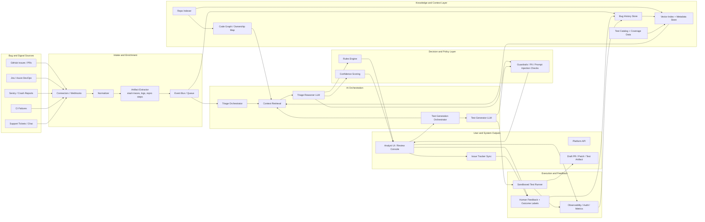

# AI-Assisted Bug Triage and Test Generation System

Status: Draft v0.1  
Date: 2026-04-19

## 1. Purpose

This document defines the initial product design and system architecture for an AI-assisted platform that:

- ingests bugs and incidents from engineering systems,
- helps teams triage, prioritize, deduplicate, and route defects,
- generates candidate tests from bug reports and code context,
- validates those tests in CI before proposing them to developers.

The intended outcome is lower mean time to triage, better ownership assignment, faster root-cause discovery, and stronger regression coverage.

## 2. Product Vision

Build a system that sits between incoming defect signals and the engineering workflow. It should turn noisy issue reports into structured, reviewable recommendations:

- what the bug likely is,
- how severe it is,
- which team or service likely owns it,
- whether it is a duplicate,
- what evidence supports that conclusion,
- what tests should be added to prevent regression.

The product is AI-assisted, not AI-autonomous. Every high-impact output should remain reviewable and overrideable by humans.

## 3. Target Users

- QA engineers who need faster triage and reproducible defect summaries.
- Engineering leads who need reliable prioritization and ownership routing.
- Developers who need bug context, likely root-cause hints, and test scaffolds.
- Support or operations teams who need issue clustering and escalation guidance.

## 4. Problem Statement

Bug intake is usually fragmented across issue trackers, error monitoring tools, support systems, CI logs, and chat. Teams lose time because:

- duplicate bugs are filed repeatedly,
- reports are incomplete or inconsistently structured,
- ownership is unclear,
- severity is subjective,
- regressions are fixed without adding durable automated tests.

Large language models are useful here, but only if grounded in repository context, historical bug data, runtime telemetry, and policy-driven validation.

## 5. Product Goals

### Business goals

- Reduce mean time to triage.
- Improve defect routing accuracy.
- Increase regression test coverage for production bugs.
- Lower manual effort spent summarizing and classifying issues.

### Product goals

- Produce structured triage recommendations with confidence scores.
- Surface supporting evidence, not just predictions.
- Generate repository-specific tests instead of generic templates.
- Integrate into existing developer tooling with low workflow friction.

### Non-goals for the first version

- Full autonomous bug fixing.
- Fully automated issue closure without human approval.
- Cross-repo code modification at enterprise scale on day one.

## 6. Core Capabilities

### 6.1 Bug intake and normalization

- Ingest bugs from GitHub Issues, Jira, Sentry, CI failures, logs, and support tickets.
- Normalize raw payloads into a common bug record.
- Extract structured fields such as title, steps to reproduce, environment, stack trace, impacted component, and attachments.

### 6.2 AI-assisted triage

- Classify severity, priority, component, and probable owner.
- Detect duplicates and cluster related issues.
- Generate a concise bug summary and likely root-cause hypotheses.
- Recommend next actions such as reproduce, escalate, assign, or request more data.

### 6.3 Contextual retrieval

- Retrieve similar historical bugs and their resolutions.
- Retrieve code ownership, blame data, service catalog entries, and recent commits.
- Retrieve existing tests, failing tests, and coverage gaps related to the bug area.

### 6.4 Test generation

- Produce candidate unit, integration, API, or UI tests based on bug details and repository context.
- Align test style with the target repository's frameworks and conventions.
- Create negative-path and regression-focused assertions.
- Validate generated tests via linting, compilation, and sandboxed CI execution.

### 6.5 Review and feedback loop

- Let users accept, edit, reject, or reroute AI suggestions.
- Capture decisions as feedback signals for ranking, retrieval, and prompt refinement.
- Track the downstream impact of accepted suggestions.

## 7. High-Level Architecture

The platform is composed of seven major layers:

1. Source connectors
2. Intake and enrichment pipeline
3. Knowledge and context layer
4. AI orchestration layer
5. Decisioning and policy layer
6. User workflow surfaces
7. Execution, observability, and feedback systems

### Architecture Diagram

## 8. Component Design

### 8.1 Source connectors

Responsibilities:

- listen to webhooks or poll source systems,
- map external schemas into an internal bug event schema,
- preserve source provenance and source-specific identifiers,
- retry safely and support idempotent delivery.

Typical integrations:

- GitHub, Jira, Azure DevOps
- Sentry, Datadog, Crashlytics
- Jenkins, GitHub Actions, Buildkite
- Zendesk, Intercom, Slack

### 8.2 Intake and enrichment pipeline

Responsibilities:

- clean and normalize data,
- extract stack traces, logs, screenshots, and repro steps,
- classify issue type,
- redact secrets or sensitive data,
- emit durable events for downstream processing.

Key outputs:

- normalized bug record,
- attachment metadata,
- searchable bug narrative,
- traceable audit record.

### 8.3 Knowledge and context layer

This is the grounding system for AI decisions.

Stores:

- historical bugs and resolutions,
- repository structure and dependency graph,
- ownership and CODEOWNERS mappings,
- recent commit history and blame metadata,
- existing tests, coverage reports, and flaky test markers,
- embeddings for semantic retrieval.

Recommended storage split:

- relational DB for normalized entities and workflow state,
- object store for logs, screenshots, and large artifacts,
- vector store for semantic search,
- graph or indexed metadata store for ownership and dependency traversal.

### 8.4 Triage orchestrator

Responsibilities:

- decide when triage should run,
- fetch relevant context,
- build structured prompts,
- call one or more models,
- aggregate model output with rules-based checks,
- produce a triage recommendation package.

Output structure:

- summary,
- severity and priority suggestion,
- probable owner or team,
- duplicate candidates,
- root-cause hypotheses,
- confidence score,
- evidence references,
- recommended next action.

### 8.5 Test generation orchestrator

Responsibilities:

- determine the best test layer for the bug,
- assemble code and issue context,
- detect the test framework in use,
- generate candidate tests,
- run validation and reduce failure loops,
- publish accepted artifacts as patches or PRs.

Generation targets:

- unit tests for pure logic regressions,
- integration tests for service boundaries,
- API tests for contract or status-code regressions,
- UI or end-to-end tests for reproduction-critical flows.

### 8.6 Rules and policy layer

Rules are required because some decisions should not be left to a model alone.

Examples:

- severity cannot be auto-set to critical without matching production impact signals,
- ownership suggestion must consider CODEOWNERS and service catalog rules,
- generated tests cannot be proposed if they touch protected paths,
- bug data with secrets or regulated content must be masked before model use.

### 8.7 Review console and APIs

User-facing capabilities:

- issue queue with AI-generated triage cards,
- evidence panel with retrieved similar bugs and relevant commits,
- one-click accept/edit/reject actions,
- generated test preview with diff and execution results,
- audit trail of decisions and confidence explanations.

## 9. Key Workflows

### 9.1 Bug triage workflow

1. A new bug arrives from an external source.
2. The intake pipeline normalizes data and extracts evidence.
3. The triage orchestrator retrieves similar incidents, owners, commits, and tests.
4. The LLM generates structured triage hypotheses.
5. The rules layer validates or constrains the result.
6. A reviewer sees the recommendation with evidence and confidence.
7. Approved output syncs back to Jira, GitHub, or the relevant system.

### 9.2 Test generation workflow

1. A triaged bug is marked eligible for regression coverage.
2. The test orchestrator identifies the affected repository area and test framework.
3. The system retrieves nearby code, existing tests, bug context, and reproduction clues.
4. The LLM generates one or more candidate tests.
5. The runtime validates syntax, lint, compile, and test execution.
6. The system returns a patch, draft PR, or failed-attempt report for review.
7. Human approval decides whether the generated tests are merged.

## 10. Internal Data Model

Core entities:

- `BugRecord`: normalized bug or defect object
- `Artifact`: logs, screenshots, traces, attachments
- `TriageRecommendation`: structured AI output with evidence and confidence
- `DuplicateCluster`: semantically related bug group
- `RepoContext`: code, ownership, dependency, and commit metadata
- `TestCandidate`: generated test artifact and execution results
- `FeedbackEvent`: human or system decision used for learning and ranking

Important fields on `BugRecord`:

- source system and source ID
- title and summary
- raw description and normalized description
- reproduction steps
- environment and version
- stack trace or error fingerprint
- severity and priority
- owner or team
- status and timestamps

## 11. AI System Design

### 11.1 Model roles

Use specialized model calls rather than one large prompt for everything:

- extraction model for issue cleanup and schema mapping,
- triage reasoning model for severity, ownership, duplicates, and hypotheses,
- test generation model for repository-aware test production,
- evaluator model or deterministic checks for quality scoring.

### 11.2 Retrieval strategy

Use retrieval-augmented generation with multiple indexes:

- semantic similarity over historical bugs,
- lexical retrieval over stack traces and exact error strings,
- structural retrieval over code ownership and dependency graphs,
- test retrieval for nearby files, frameworks, and assertion style.

### 11.3 Guardrails

- redact secrets and PII before model calls,
- require citations to internal evidence objects,
- block unsupported claims when retrieval confidence is weak,
- store prompt and response metadata for auditability,
- limit code-generation scope to approved repos and branches.

## 12. Ranking and Confidence

Confidence should be composite, not model-only.

Suggested factors:

- retrieval relevance score,
- historical resolution match score,
- source completeness score,
- model self-consistency across repeated structured passes,
- rules-engine validation score,
- test execution success rate for generated artifacts.

The UI should show confidence bands such as:

- High: safe to accept with light review
- Medium: review evidence carefully
- Low: treat as suggestion only

## 13. Deployment Architecture

Recommended initial deployment:

- API gateway for inbound webhook traffic,
- worker services for ingestion and orchestration,
- relational database for product state,
- object storage for artifacts,
- vector index for retrieval,
- sandboxed runner pool for generated test execution,
- observability stack for logs, traces, and audit trails.

Recommended service split for an MVP:

- `intake-service`
- `context-service`
- `triage-service`
- `testgen-service`
- `execution-runner`
- `review-ui`

This can start as a modular monolith if speed matters, with a queue boundary around long-running AI and test execution jobs.

## 14. Security and Compliance

- Use least-privilege access to issue trackers, repositories, and CI.
- Separate read-only context access from write-capable automation.
- Mask sensitive artifacts before storage and model calls.
- Maintain full audit trails for AI suggestions and human approvals.
- Gate merge or tracker-update actions behind policy controls.

## 15. MVP Scope

Recommended MVP boundaries:

- Integrations: GitHub, Jira, Sentry
- Triage outputs: summary, severity, owner, duplicate suggestions, next action
- Test outputs: unit and API test generation only
- Review surface: web console plus GitHub/Jira sync
- Validation: lint, compile, and targeted test execution

Success criteria:

- triage recommendation accepted or minimally edited in a meaningful share of cases,
- duplicate detection reduces repeated issue creation,
- generated tests compile and pass at a useful rate,
- accepted tests materially improve regression protection.

## 16. Phased Roadmap

### Phase 1: Foundational platform

- event ingestion,
- normalized schema,
- repository indexing,
- review console,
- basic retrieval and observability.

### Phase 2: AI triage assistant

- severity, ownership, and duplicate suggestions,
- evidence-backed summaries,
- human feedback capture.

### Phase 3: Test generation

- repository-aware prompt construction,
- sandboxed validation,
- draft PR or patch creation.

### Phase 4: Optimization

- ranking improvements,
- organization-specific policies,
- model routing by bug type,
- analytics and outcome-based tuning.

## 17. Open Design Decisions

These should be resolved before implementation starts:

- Will the first release be multi-tenant or single-tenant?
- Which repositories and languages are in scope for test generation?
- Should generated tests be committed to a branch automatically or only exported as patches?
- What confidence threshold is required before auto-routing ownership?
- Which source of truth defines service ownership: CODEOWNERS, service catalog, or team metadata?

## 18. Recommended Next Step

After this design is approved, the next document should be a technical implementation plan covering:

- detailed service boundaries,
- database schema,
- event contracts,
- prompt contracts,
- evaluation metrics,
- MVP build order,
- infrastructure setup and CI integration.
